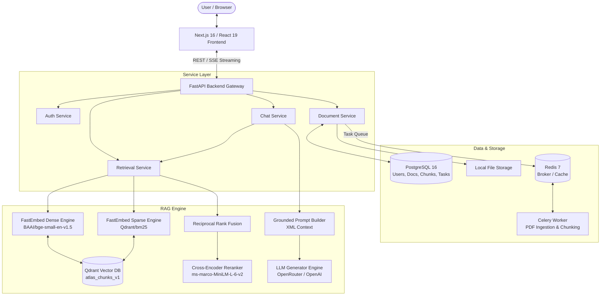

# ATLAS

Enterprise Hybrid Retrieval-Augmented Generation (RAG) Platform.

ATLAS is a high-performance, enterprise-grade Retrieval-Augmented Generation platform designed to bridge internal organizational data with Large Language Models (LLMs). It solves the challenges of data privacy, domain-specific hallucination, and multi-tenant isolation by unifying dense semantic vector search, BM25 sparse keyword retrieval, Reciprocal Rank Fusion (RRF), and Cross-Encoder neural reranking into a single cohesive architecture.

---

## Overview

ATLAS provides a complete end-to-end framework for ingesting enterprise documents, indexing text chunks, and serving grounded LLM responses with source citations.

Key architectural highlights include:
* **Hybrid Retrieval Strategy**: Combines dense vector search (`BAAI/bge-small-en-v1.5`) and sparse keyword search (`Qdrant/bm25`) to handle both conceptual similarity and exact term matching.
* **Rank Fusion & Neural Reranking**: Merges multi-channel search results using Reciprocal Rank Fusion (RRF) and refines top candidates with a SentenceTransformers Cross-Encoder (`cross-encoder/ms-marco-MiniLM-L-6-v2`).
* **Multi-Tenant Data Isolation**: Payload-level tenant scoping (`tenant_id`) enforced across both relational database records and vector collection indexes.
* **Asynchronous PDF Processing Pipeline**: Background document extraction (PyMuPDF), sentence-aware chunking (LlamaIndex & Tiktoken), and embedding generation powered by Celery workers and Redis.
* **Grounded Generation & Streaming**: OpenRouter/OpenAI-compatible LLM inference featuring token streaming via Server-Sent Events (SSE) and automatic short-circuit fallback when no relevant context is retrieved.

---

## Architecture

The diagram below illustrates the end-to-end component interaction and data flow within ATLAS:



---

## Request Flow

A typical user interaction follows a structured execution path through the backend:

```text
User Query (Frontend)
   │
   ▼
POST /api/v1/chat (or /chat/stream)
   │
   ▼
ChatService Orchestration
   │
   ▼
RetrievalService (Hybrid Retrieval)
   ├── FastEmbed Dense Vector Generation (384-d)
   ├── FastEmbed BM25 Sparse Vector Generation
   ├── Qdrant Vector Search (Filtered by tenant_id)
   ├── Reciprocal Rank Fusion (RRF)
   └── Cross-Encoder Neural Reranking
   │
   ▼
Empty Context Check (Guard Clause)
   ├── If No Chunks: Short-circuit LLM & Return Fallback Response
   └── If Chunks Found: Format Context into <context> XML Tags
   │
   ▼
LLMGeneratorEngine (OpenRouter / OpenAI API)
   ├── Exponential Backoff & Retry Logic
   └── Token Streaming / Full Completion Assembly
   │
   ▼
Response Construction (Answer + Citation Sources with Scores)
   │
   ▼
Frontend Rendering (Streaming Tokens + Citation Badges)
```

---

## Core Components

| Component | Technology | Description |
| :--- | :--- | :--- |
| **Backend Framework** | FastAPI (Python 3.11+) | Async web framework providing OpenAPI specifications, custom exception handling, CORS middleware, and dependency injection. |
| **Relational Database** | PostgreSQL 16 (SQLAlchemy 2.0 / asyncpg) | Stores structured domain data including users, document records, chunk metadata, and background task statuses. Managed via Alembic migrations. |
| **Vector Database** | Qdrant v1.8.4 | High-performance vector engine configured with payload indexing (`tenant_id`, `document_id`) supporting Cosine dense and BM25 sparse vectors. |
| **Task Queue & Broker** | Redis 7 & Celery 5.6 | Async background task execution for heavy PDF processing, text extraction, and offloaded vector index creation. |
| **Embedding Engines** | FastEmbed (`bge-small-en-v1.5` & `bm25`) | ONNX-accelerated local embedding generators producing 384-dimensional dense vectors and BM25 sparse index representations. |
| **Neural Reranker** | SentenceTransformers | Cross-Encoder (`cross-encoder/ms-marco-MiniLM-L-6-v2`) re-scoring retrieved candidates to ensure top context relevance. |
| **LLM Provider** | OpenAI-compatible Client | Multi-provider support (OpenRouter, Groq, OpenAI) with configurable temperature, token limits, backoff retries, and SSE streaming. |
| **Frontend Application** | Next.js 16 (React 19 / TypeScript) | Web application featuring a live Chat interface, citation source popovers, drag-and-drop PDF manager, and JWT auth flow. |

---

## Repository Structure

```text
atlas/
├── backend/
│   ├── alembic/              # Database migration scripts
│   ├── app/
│   │   ├── api/              # FastAPI routers (v1 endpoints: auth, chat, documents, retrieval, tasks, health)
│   │   ├── core/             # Application configuration, logging, exceptions, security
│   │   ├── db/               # Async SQLAlchemy session management and ORM models (user, document, task)
│   │   ├── rag/              # Core RAG engine (embeddings, qdrant service, reranker, prompts, generator)
│   │   ├── schemas/          # Pydantic data transfer objects (DTOs) for API contracts
│   │   ├── services/         # Service layer (chat_service, document_service, retrieval_service)
│   │   └── workers/          # Celery worker definitions and PyMuPDF/LlamaIndex PDF processing tasks
│   ├── deploy/               # Deployment configurations (Dockerfile.api, Dockerfile.worker, docker-compose.yml)
│   ├── tests/                # Unit and integration test suites
│   └── pyproject.toml        # Backend dependencies and project metadata
│
└── frontend/
    ├── app/                  # Next.js App Router pages and global styles
    ├── components/           # React UI components (auth, chat, documents, Navbar)
    ├── lib/                  # Frontend utilities and API integration clients (auth, chat, documents)
    └── package.json          # Node.js dependencies and build scripts
```

---

## Data / RAG Flow

The document ingestion and indexing pipeline processes enterprise documents before they are available for retrieval:

```text
PDF Document Upload (POST /api/v1/documents/upload)
   │
   ▼
Binary & Magic Byte Validation (PDF Header & 50MB Limit)
   │
   ▼
Disk Storage & PostgreSQL Document Metadata Registration (Status: PENDING)
   │
   ▼
Celery Background Task Dispatch (process_document_task)
   │
   ├── PyMuPDF (fitz) Text Extraction & Cleaning
   └── LlamaIndex SentenceSplitter & Tiktoken Tokenization (510 tokens, 50 overlap)
   │
   ▼
Chunk Metadata Persisted to PostgreSQL
   │
   ▼
FastEmbed Vectorization (Dense 384-d & Sparse BM25)
   │
   ▼
Qdrant Vector Store Upsert (Payload: tenant_id, document_id, page_number, content)
   │
   ▼
Document Status Updated to COMPLETED
```

---

## Local Development

### Prerequisites

Ensure the following tools are installed on your machine:
* **Python**: `>=3.11`
* **Node.js**: `>=20.0.0` (with `npm`)
* **Docker & Docker Compose**: Installed and running

### 1. Infrastructure Setup

Launch PostgreSQL, Qdrant, and Redis using Docker Compose:

```bash
cd backend
docker compose -f deploy/docker-compose.yml up -d
```

### 2. Backend Setup

```bash
cd backend

# Create virtual environment
python -m venv .venv

# Activate virtual environment
# On Linux/macOS:
source .venv/bin/activate
# On Windows (PowerShell):
# .venv\Scripts\Activate.ps1

# Install backend package in editable mode
pip install -e .

# Run FastAPI development server
uvicorn app.main:app --reload --port 8000
```

Backend API will be accessible at `http://localhost:8000`.

### 3. Frontend Setup

In a separate terminal window:

```bash
cd frontend

# Install Node dependencies
npm install

# Start Next.js development server
npm run dev
```

Frontend application will be accessible at `http://localhost:3000`.

---

## Environment Configuration

Environment settings are configured via environment files. Copy `.env.example` in `backend/` to `.env`:

### Backend Environment Variables (`backend/.env.example`)

```env
# Application Configuration
PROJECT_NAME="ATLAS Enterprise Hybrid RAG"
VERSION="1.0.0"
ENVIRONMENT="development"
API_V1_STR="/api/v1"
HOST="0.0.0.0"
PORT=8000

# PostgreSQL Configuration
POSTGRES_USER="atlas_user"
POSTGRES_PASSWORD="atlas_password"
POSTGRES_SERVER="localhost"
POSTGRES_PORT=5432
POSTGRES_DB="atlas_db"

# Qdrant Vector Search Engine
QDRANT_HOST="localhost"
QDRANT_PORT=6333

# Redis Cache & Message Broker
REDIS_HOST="localhost"
REDIS_PORT=6379

# LLM Provider Configuration
LLM_PROVIDER="openrouter"
LLM_API_KEY="your_api_key_here"
LLM_MODEL="meta-llama/llama-3.3-70b-instruct:free"
LLM_BASE_URL="https://openrouter.ai/api/v1"
LLM_TIMEOUT_SECONDS=30.0
LLM_MAX_TOKENS=1000
LLM_TEMPERATURE=0.2
LLM_MAX_RETRIES=3
```

### Frontend Environment Variables (`frontend/.env.local`)

```env
NEXT_PUBLIC_API_URL="http://localhost:8000/api/v1"
```

---

## Development / Debugging Guide

When investigating or adding features to ATLAS, trace execution through these key directories:

### Tracing a Request Lifecycle

```text
1. Frontend Request:      frontend/lib/api/chat.ts
2. API Endpoint:          backend/app/api/v1/chat.py
3. Business Orchestrator: backend/app/services/chat_service.py
4. Hybrid Retrieval:      backend/app/services/retrieval_service.py
5. Vector & Reranking:    backend/app/rag/ (embeddings.py, qdrant.py, reranker.py)
6. LLM Completion:        backend/app/rag/generator.py
```

### Key Modules to Inspect First

* **FastAPI Entry Point**: [`backend/app/main.py`](file:///c:/Users/kisho/Desktop/Atlas/backend/app/main.py)
* **API Routers**: [`backend/app/api/v1/`](file:///c:/Users/kisho/Desktop/Atlas/backend/app/api/v1)
* **RAG Pipeline**: [`backend/app/rag/`](file:///c:/Users/kisho/Desktop/Atlas/backend/app/rag)
* **Background Worker Tasks**: [`backend/app/workers/tasks.py`](file:///c:/Users/kisho/Desktop/Atlas/backend/app/workers/tasks.py)
* **Frontend Main Page**: [`frontend/app/page.tsx`](file:///c:/Users/kisho/Desktop/Atlas/frontend/app/page.tsx)

---

## API & Documentation

When the backend server is running, interactive API documentation is automatically generated by FastAPI:

* **Swagger UI**: `http://localhost:8000/api/v1/docs`
* **ReDoc**: `http://localhost:8000/api/v1/redocs`
* **Health Check**: `http://localhost:8000/api/v1/health`

---

## Testing

### Running Backend Tests

Backend tests cover vector service operations, hybrid reranking, chat generation, and PDF processing:

```bash
cd backend
pytest
```

To run a specific test module:

```bash
cd backend
pytest tests/unit/test_phase10_hybrid_rerank.py
```

### Running Frontend Checks

```bash
cd frontend
npm run lint
```

---

## Design Principles

* **Decoupled RAG Pipeline**: Vector embeddings, retrieval, reranking, and LLM generation are organized into independent, testable modules.
* **Strict Multi-Tenant Scoping**: All search queries require explicit `tenant_id` filters passed directly down to Qdrant vector index payloads.
* **Defense-in-Depth Retrieval**: Dual dense/sparse channels fused with RRF prevent semantic hallucination while preserving keyword accuracy.
* **Asynchronous Offloading**: Heavy PDF extraction, token chunking, and embedding creation are offloaded to Celery background workers.
* **Grounded Integrity**: LLM context is strictly encapsulated within XML tags, with automatic short-circuiting when zero context is returned.

---

## Current Status

ATLAS is under active development. Current operational capabilities include:
* Full Dense + BM25 Sparse vector hybrid search with RRF fusion and Cross-Encoder neural reranking.
* Asynchronous PDF text extraction and chunking pipeline.
* OpenRouter / OpenAI LLM integration supporting non-streaming and Server-Sent Event (SSE) streaming answers.
* Interactive Next.js web application with Chat interface, Citation badges, and Document Manager.

---

## Future Direction

* Additional document parser support (DOCX, Markdown, HTML, CSV).
* Advanced RAG evaluation metrics (RAGAS / TruLens integration).
* Dynamic collection creation per tenant.
* Expanded agentic tool integration for web search and multi-step reasoning.