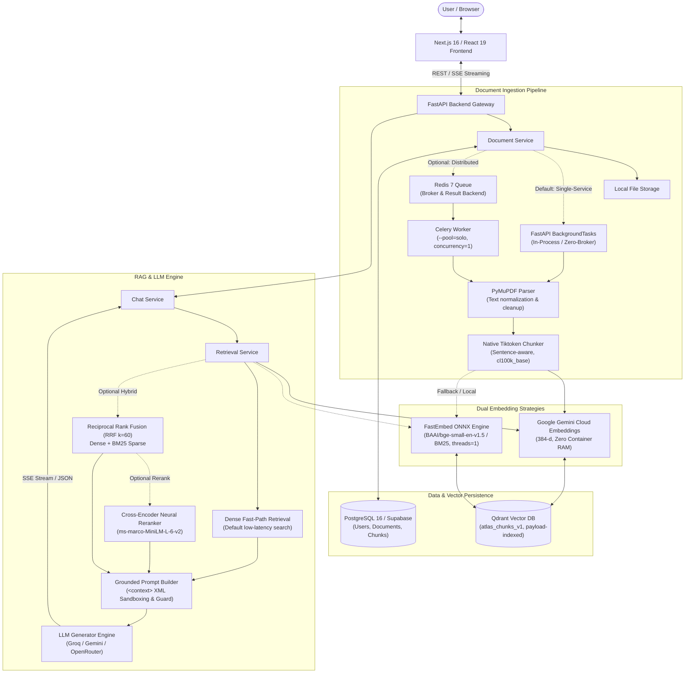
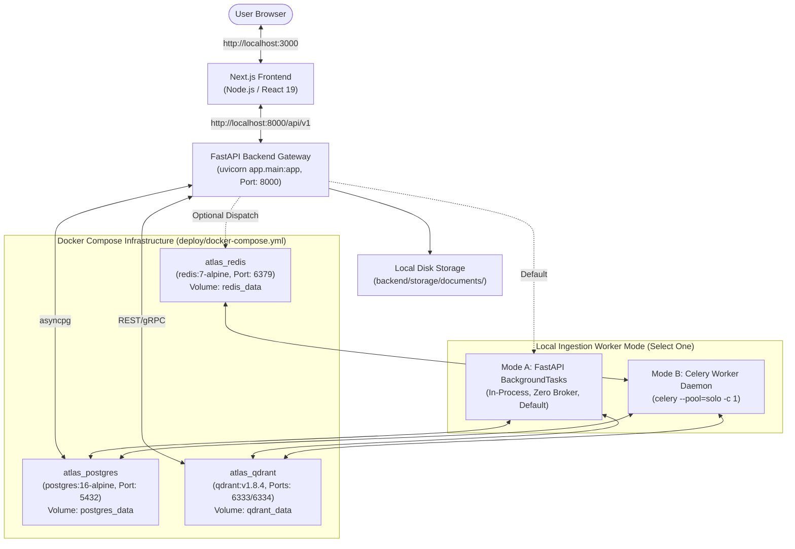
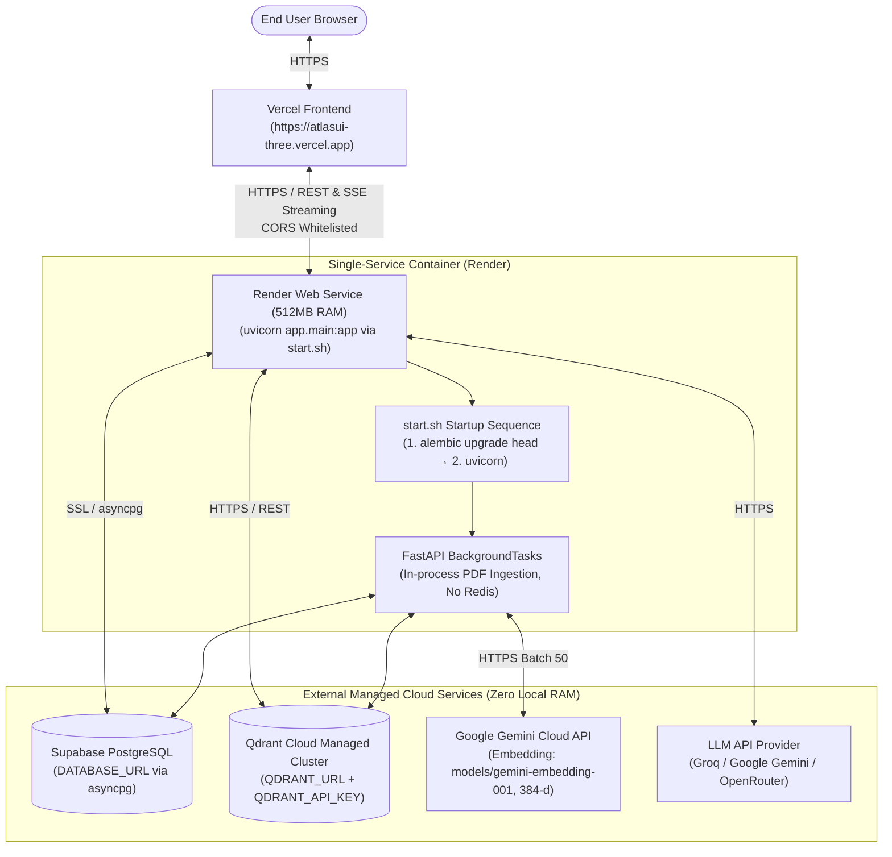

# ATLAS

**Enterprise Hybrid Retrieval-Augmented Generation (RAG) Platform.**

ATLAS is a high-performance, enterprise-grade Retrieval-Augmented Generation platform designed to bridge internal organizational data with Large Language Models (LLMs). It solves the challenges of data privacy, domain-specific hallucination, and multi-tenant isolation by unifying dense semantic vector search, BM25 sparse keyword retrieval, Reciprocal Rank Fusion (RRF), and Cross-Encoder neural reranking into a single cohesive architecture.

---

## Why ATLAS / Key Capabilities

ATLAS provides an end-to-end framework for ingesting enterprise documents, indexing text chunks, and serving grounded LLM responses with source citations. The platform balances retrieval precision against strict operational constraints:

* **Dual Embedding Strategies**: Supports zero-container-RAM Google Gemini Cloud Embeddings (384-dimensional configuration via `models/gemini-embedding-001`) for resource-constrained micro-instances, alongside local FastEmbed ONNX (`BAAI/bge-small-en-v1.5` dense and `Qdrant/bm25` sparse, constrained to `threads=1`) as an offline fallback.
* **Lightweight Document Ingestion & Chunking**: Sentence-aware chunking built directly with native `tiktoken` (`cl100k_base`) and regex boundary lookaheads (510 tokens, 50 token overlap). Eliminates heavy framework overhead (such as LlamaIndex) to save ~180MB RAM on container initialization.
* **Dual Ingestion Worker Modes**: Supports both native in-process FastAPI `BackgroundTasks` (the lightweight default for single-service deployments without external brokers) and distributed Celery (`>=5.6.3`) + Redis (`>=8.1.0`) workers running a single-concurrency `solo` process pool.
* **Low-Latency Retrieval & Neural Reranking**: Executes fast-path dense similarity search in Qdrant for rapid conversational response times, with on-demand multi-channel hybrid search (dense + BM25 sparse fused via Reciprocal Rank Fusion, RRF $k=60$) and optional Cross-Encoder neural reranking (`cross-encoder/ms-marco-MiniLM-L-6-v2`).
* **Multi-Provider LLM Engine & Resilience**: OpenAI-compatible client architecture supporting Groq, Google Gemini (featuring automated model fallback cascading across candidate models), and OpenRouter, backed by exponential backoff retry mechanisms and Server-Sent Events (SSE) token streaming.
* **Strict Multi-Tenant Scoping & Grounding Guard**: Enforces payload-level tenant isolation (`tenant_id`) across relational and vector databases, combined with an empty-context short-circuit guard that intercepts out-of-domain queries before LLM invocation to eliminate hallucinations.
* **512MB RAM Target Profile**: Core services and data paths are deliberately optimized to operate reliably within a 512MB container RAM envelope (e.g., Render free tier) through zero-RAM cloud embeddings, brokerless background tasks, single-threaded runtimes, and framework pruning.

---

## Architecture

The diagram below illustrates the end-to-end component interaction, dual ingestion pathways, and retrieval data flow within ATLAS:



### Architectural Design Philosophy: Constrained-Resource Profiles

ATLAS is intentionally engineered around constrained-resource deployment profiles (e.g., 512MB RAM micro-containers and serverless environments). Rather than requiring heavyweight distributed infrastructure for every deployment, the architecture cleanly decouples:

1. **Lightweight Single-Service vs. Distributed Worker Operation**: Ingestion can run entirely in-process using native FastAPI `BackgroundTasks` without external brokers, or scale horizontally through Celery workers and Redis.
2. **Zero-RAM Cloud Embeddings vs. Local ONNX Models**: Document chunking and query embedding can execute via Google Gemini's Cloud Embedding API (384 dimensions) consuming zero container RAM, or run locally via FastEmbed ONNX constrained to single-thread mode (`threads=1`).
3. **Native Token Chunking vs. Heavy Frameworks**: Text extraction uses PyMuPDF and native `tiktoken` sentence splitting, eliminating ~180MB of transitive AST/orchestration framework imports (such as LlamaIndex).
4. **Fast-Path Dense vs. Multi-Stage Hybrid Reranking**: The chat pipeline prioritizes direct dense vector search to sustain low-latency conversational streaming, while retaining on-demand BM25 sparse indexing and neural reranking for complex domain retrieval.

---

## Core Components

| Component | Current Implementation | Purpose / Notes |
| :--- | :--- | :--- |
| **Backend Framework** | FastAPI (`>=0.110.0`) / Uvicorn (`>=0.28.0`) | Async API gateway providing OpenAPI specs, dependency injection, CORS handling, and SSE streaming. Python `>=3.11`. |
| **Relational Database** | PostgreSQL 16 (SQLAlchemy `>=2.0.28`, `asyncpg>=0.29.0`) | Structured domain persistence (users, documents, chunks) managed via Alembic (`>=1.13.1`). Supports local PostgreSQL or cloud Supabase (`DATABASE_URL`). |
| **Vector Database** | Qdrant (`qdrant-client>=1.19.0`, engine v1.8.4+) | High-performance vector engine with payload schema indexes (`tenant_id`, `document_id`) supporting Cosine dense (384-d) and BM25 sparse vectors. |
| **Task Workers (Dual Mode)** | FastAPI `BackgroundTasks` (Default) / Celery (`>=5.6.3`) | Dual execution: native in-process `BackgroundTasks` for single-service zero-broker deployments; Celery (`--pool=solo`) + Redis for distributed worker setups. |
| **Cache & Message Broker** | Redis (`redis>=8.1.0`, Redis 7) | Optional Celery task broker and result backend. Not required when running in single-service `BackgroundTasks` mode. |
| **Document Parser** | PyMuPDF (`pymupdf>=1.28.2`, `pypdf>=6.15.0`) | PDF text extraction with text cleaning, null-byte (`\0`) removal, and hyphenated line-break de-stitching. |
| **Text Chunker** | Native `tiktoken` (`>=0.13.0`, `cl100k_base`) + regex | Lightweight sentence-aware token chunker (510 tokens, 50 overlap). Zero heavy ML/AST dependencies (eliminates LlamaIndex to save ~180MB RAM). |
| **Embedding Engines** | Google Gemini Cloud API (384-d) / FastEmbed (`>=0.8.0`) | Dual strategy: Zero-RAM Gemini Cloud embeddings (`models/gemini-embedding-001`, 384-d) for memory-constrained environments; local FastEmbed ONNX (`BAAI/bge-small-en-v1.5` dense & `Qdrant/bm25` sparse, `threads=1`) fallback. |
| **Rank Fusion & Reranker** | Reciprocal Rank Fusion (RRF $k=60$) & SentenceTransformers (`>=6.0.0`) | Multi-channel dense/sparse rank merging; optional lazy-loaded Cross-Encoder (`cross-encoder/ms-marco-MiniLM-L-6-v2`) neural reranking. |
| **LLM Inference Engine** | OpenAI-compatible Client (`openai>=3.3.1`) | Multi-provider support (Groq, Google Gemini with automatic model fallback cascade, OpenRouter) with token streaming (SSE) and exponential backoff retry. |
| **Frontend Application** | Next.js 16 (`16.3.3`, React `19.2.8`, TypeScript `^5`) | Web client featuring live chat, token streaming, citation badges, document manager, and light/dark mode with TailwindCSS 4. |

---

## How It Works

### Document Ingestion Flow

ATLAS implements an asynchronous, multi-stage document processing pipeline designed to handle PDF extraction, sentence-aware tokenization, dense vector embedding, and dual relational/vector persistence.

#### Text Ingestion Flow

```text
1. Client Upload:            POST /api/v1/documents/ (PDF file stream, multipart/form-data)
2. Ingress Validation:       Verify %PDF magic header bytes and 50MB file size limit
3. Deduplication Check:      Compute SHA-256 hash -> If COMPLETED record exists, return immediately
4. State Initialization:     Purge stale FAILED/PROCESSING records -> Save PDF to disk -> Insert PENDING row
5. Worker Dispatch:          Route execution to FastAPI BackgroundTasks (default) or Celery + Redis
6. Text Extraction:          PyMuPDF (fitz) extraction with null-byte removal and line-wrap de-hyphenation
7. Sentence Token Chunking:  Native tiktoken (cl100k_base) sentence lookahead chunker (510 tokens, 50 overlap)
8. State Transition:         Update Document status -> PROCESSING in PostgreSQL
9. Embedding Generation:     Generate 384-d dense vectors (Google Gemini Cloud API or local FastEmbed ONNX)
10. Relational Persistence:  Insert Chunk records into PostgreSQL -> Generate UUID primary keys (chunk.id)
11. Vector Store Upsert:     Upsert PointStruct to Qdrant (atlas_chunks_v1) with Point ID = chunk.id and tenant filter
12. Completion & Cleanup:    Update Document status -> COMPLETED in PostgreSQL -> Trigger explicit gc.collect()
```

#### Ingestion Architecture & Execution Diagram

```mermaid
flowchart TD
    Client([Client / Frontend]) -->|POST /api/v1/documents/<br/>(multipart/form-data PDF)| UploadAPI["FastAPI Upload Router<br/>(backend/app/api/v1/documents.py)"]

    subgraph Step1["1. Validation & Integrity Check"]
        UploadAPI --> Validate["Binary Header Validation<br/>(Magic bytes: %PDF, Max: 50MB)"]
        Validate --> Checksum["Compute SHA-256 Checksum<br/>(DocumentService.compute_sha256)"]
        Checksum --> DedupCheck{"Existing COMPLETED<br/>document with hash?"}
        DedupCheck -->|Yes| FastReturn["Return Existing Document Record<br/>(Skip redundant processing)"]
        DedupCheck -->|No| PurgeStale["Purge Stale FAILED/PROCESSING Rows<br/>(Allows seamless retry on re-upload)"]
        PurgeStale --> SaveDisk["Persist PDF to Local Disk<br/>(storage/documents/{uuid}_{filename})"]
        SaveDisk --> CreatePending["Insert Document Row<br/>Status: PENDING in PostgreSQL"]
    end

    subgraph Step2["2. Worker Dispatch (Dual Execution Modes)"]
        CreatePending --> WorkerBranch{"Execution Profile"}
        WorkerBranch -->|Default: Single-Service| BgTaskDispatch["FastAPI BackgroundTasks<br/>(In-process, zero broker dependencies)"]
        WorkerBranch -->|Distributed Setup| CeleryDispatch["Celery Worker Dispatch<br/>(Redis broker queue: process_document_task)"]
    end

    subgraph Step3["3. Centralized Ingestion Pipeline (pipeline.py)"]
        BgTaskDispatch --> ExtractText["PyMuPDF (fitz) Text Extraction<br/>(clean_text: strip null-bytes & de-hyphenate)"]
        CeleryDispatch --> ExtractText
        ExtractText --> ChunkPages["Native Tiktoken Sentence Chunking<br/>(chunk_size=510, overlap=50, cl100k_base)"]
        ChunkPages --> MarkProcessing["Update Document Status &rarr; PROCESSING<br/>(PostgreSQL)"]
        MarkProcessing --> CheckQdrant["Verify Qdrant Connectivity<br/>(Collection: atlas_chunks_v1)"]
        CheckQdrant --> EmbedChunks["Dense Embedding Generation<br/>(Cloud Gemini 384-d or Local FastEmbed)"]
        EmbedChunks --> InsertChunks["Persist Chunks to PostgreSQL<br/>(Generate UUID chunk.id rows)"]
        InsertChunks --> UpsertQdrant["Upsert Vectors to Qdrant<br/>(Point ID = chunk.id, tenant_id payload index)"]
        UpsertQdrant --> MarkComplete["Update Document Status &rarr; COMPLETED<br/>(Explicit gc.collect)"]
    end

    subgraph ErrorHandling["Fault Tolerance & Observability"]
        ExtractText -.->|Exception| MarkFailed["mark_document_failed<br/>(Status: FAILED, record error_message)"]
        ChunkPages -.->|Exception| MarkFailed
        EmbedChunks -.->|Exception| MarkFailed
        UpsertQdrant -.->|Exception| MarkFailed
    end
```

#### Ingestion Execution Modes: Single-Service vs. Distributed

ATLAS decouples the ingestion pipeline logic from the background execution mechanism. The core processing pipeline (`run_ingestion_pipeline` in [`backend/app/workers/pipeline.py`](file:///c:/Users/kisho/Desktop/Atlas/backend/app/workers/pipeline.py)) is shared across two execution modes:

* **Mode A: FastAPI `BackgroundTasks` (Default / Single-Service Profile)**: Executes directly within the FastAPI web process after the HTTP response (`202 Accepted`) is returned. Operates entirely in-process without requiring Redis or Celery worker daemons, designed specifically for micro-container deployments (e.g., Render 512MB RAM free tier).
* **Mode B: Celery + Redis (Distributed Background Worker Profile)**: Offloads document processing to dedicated Celery worker containers via Redis (`REDIS_URL`). Configured to run in a single-concurrency `solo` process pool (`celery -A app.workers.celery_app worker --pool=solo -c 1`), eliminating the memory duplication of prefork multiprocessing.

#### Ingestion Integrity & Deduplication

1. **Content-Addressable SHA-256 Deduplication**: `DocumentService.compute_sha256` computes the hexadecimal SHA-256 hash of the raw binary payload. If an identical `COMPLETED` record exists, ingestion is bypassed immediately. If previous attempts exist in `FAILED` or `PROCESSING` state, stale rows are automatically purged to allow clean retries.
2. **Deterministic 1-to-1 Vector Identification**: Chunks committed to PostgreSQL generate UUID primary keys (`Chunk.id`). That identical string is passed as Qdrant's `PointStruct.id` and saved back to `Chunk.qdrant_point_id`, guaranteeing bidirectional traceability.
3. **Orphan Vector Prevention on Deletion**: `DELETE /api/v1/documents/{document_id}` unlinks the physical PDF, executes a payload-filtered point deletion in Qdrant across points matching `document_id`, and cascades PostgreSQL records.
4. **Guaranteed State Sequencing**: Documents transition `PENDING` &rarr; `PROCESSING` &rarr; `COMPLETED`. Status is only updated to `COMPLETED` after Qdrant confirms successful upsert.

---

### Query & Grounded RAG Flow

ATLAS serves user queries through a multi-stage RAG pipeline that balances conversational response latency against deep retrieval precision.

#### Text Retrieval & Generation Flow

```text
1. Client Query:             POST /api/v1/chat/completions (SSE streaming) or POST /api/v1/chat/ask (synchronous)
2. Context Resolution:       Extract tenant_id (tenant_default) and query parameters from request
3. Query Embedding:          Generate 384-dimensional dense vector via Gemini Cloud API (or FastEmbed fallback)
4. Fast-Path Dense Search:   Query Qdrant for top-K nearest neighbors filtered by tenant_id (chat default)
5. Empty Context Guard:      If retrieved chunks count == 0, short-circuit LLM and return static fallback response
6. Grounded Prompt Assembly: Format retrieved chunks into sandboxed <context> XML tags with [Source X] instructions
7. LLM Model Cascading:      Invoke LLMGeneratorEngine (Groq, Gemini, OpenRouter) with automatic fallback cascade
8. Transient Error Retry:    Execute exponential backoff (2^attempt seconds) for recoverable API errors
9. Stream Response:          Yield Server-Sent Events (SSE) tokens (events: sources -> token -> done) to client
```

#### Retrieval & Generation Architecture Diagram

```mermaid
flowchart TD
    User([User / Browser]) -->|POST /api/v1/chat/completions (Stream)<br/>or POST /api/v1/chat/ask (Sync)| ChatAPI["FastAPI Chat Router<br/>(backend/app/api/v1/chat.py)"]

    ChatAPI --> ChatSvc["ChatService Orchestrator<br/>(backend/app/services/chat_service.py)"]

    subgraph RetrievalLayer["1. Vector Retrieval Layer (retrieval_service.py)"]
        ChatSvc --> EmbedQuery["Embed Natural Language Query<br/>(Cloud Gemini 384-d or FastEmbed ONNX)"]
        
        EmbedQuery --> RetrievalPath{"Retrieval Mode"}
        
        RetrievalPath -->|Conversational Chat Default<br/>enable_hybrid=False| DenseSearch["Fast-Path Dense Qdrant Search<br/>(tenant_id filter, Top-K nearest neighbors)"]
        
        RetrievalPath -.->|Deep Retrieval Mode<br/>enable_hybrid=True| HybridSearch["Dense Search (Top-2K)<br/>+ Sparse BM25 Search (Top-2K)"]
        HybridSearch -.-> RRF["Reciprocal Rank Fusion (RRF k=60)<br/>Score = &Sigma; 1 / (60 + rank)"]
        RRF -.-> NeuralRerank{"enable_rerank=True?"}
        NeuralRerank -.->|Yes| CrossEncoder["Cross-Encoder Neural Reranking<br/>(cross-encoder/ms-marco-MiniLM-L-6-v2)"]
        NeuralRerank -.->|No| RRFTopK["Slice Top-K Candidate Chunks"]
    end

    subgraph GuardAndPrompt["2. Grounding & Sandboxing (prompts.py)"]
        DenseSearch --> ContextCheck{"Retrieved Chunks &gt; 0?"}
        CrossEncoder --> ContextCheck
        RRFTopK --> ContextCheck
        
        ContextCheck -->|No Chunks Found| ShortCircuit["Empty Retrieval Guard Clause<br/>(Short-circuit LLM & emit fallback response)"]
        
        ContextCheck -->|Context Retrieved| XMLPrompt["Build Grounded Messages<br/>(Encapsulate snippets in &lt;context&gt; XML tags)"]
    end

    subgraph LLMEngineLayer["3. Resilient LLM Inference (generator.py)"]
        XMLPrompt --> LLMEngine["LLMGeneratorEngine (OpenAI-compatible)<br/>(Groq / Google Gemini / OpenRouter)"]
        
        LLMEngine --> ModelCascade{"Candidate Model Cascade<br/>(Primary &rarr; Fallback Models)"}
        ModelCascade -->|Transient Error: 503 / 429 / 500| CascadeNext["Cascade to Next Candidate Model"]
        ModelCascade -->|Transient Exception| RetryBackoff["Exponential Backoff Retry<br/>(delay = 2^attempt, max 3 retries)"]
        
        ModelCascade -->|Generation Success| StreamResponse["SSE Token Stream / JSON Response<br/>(events: sources, token, done)"]
    end

    ShortCircuit --> StreamResponse
    StreamResponse --> User
```

#### Fast-Path Dense vs. Hybrid Retrieval Modes

* **Fast-Path Dense Retrieval (`enable_hybrid=False`) — Default for Chat**: Prioritizes latency-optimized token time-to-first-byte by executing direct dense cosine similarity search in Qdrant with `tenant_id` payload filters, bypassing sparse retrieval and reranking roundtrips.
* **Full Hybrid Retrieval & Neural Reranking (`enable_hybrid=True`) — Available via Search API**: Combines dense semantic search with FastEmbed BM25 sparse vectors, merges multi-channel candidates via Reciprocal Rank Fusion (RRF $k=60$), and optionally executes Cross-Encoder neural reranking (`cross-encoder/ms-marco-MiniLM-L-6-v2`) for deep domain precision. Exposed via `POST /api/v1/retrieval/search`.

#### Dual Embedding Strategies: Cloud vs. Local

* **Cloud Path (Google Gemini API — Zero Container RAM)**: Uses `models/gemini-embedding-001` with `outputDimensionality=384`, batched in groups of 50 chunks via REST. Consumes zero local memory, enabling 512MB cloud operation.
* **Local Path (FastEmbed ONNX Fallback)**: Uses `BAAI/bge-small-en-v1.5` (384-d dense) and `Qdrant/bm25` (sparse), constrained to `threads=1` and cached as a module-level `@lru_cache(maxsize=1)` singleton.

#### Storage Subsystem Responsibilities

| Storage Layer | Technology | Operational Responsibilities |
| :--- | :--- | :--- |
| **Relational Store** | PostgreSQL 16 / Supabase | Authoritative source of truth for users, credentials, document metadata, chunk text, and task logs. Managed via SQLAlchemy 2.0 async and Alembic. |
| **Vector Database** | Qdrant (`atlas_chunks_v1`) | High-dimensional vector index storing 384-d dense vectors (Cosine) and BM25 sparse vectors with payload isolation (`tenant_id`, `document_id`). |
| **Task Queue & Broker** | Redis 7 | Message broker and result backend for Celery distributed worker tasks. (Optional; bypassed in `BackgroundTasks` mode). |
| **Binary File Archive** | Local Disk Storage | File system archive (`storage/documents/`) holding uploaded PDF binaries, prefixed with UUIDs (`{uuid}_{filename}`). |

#### Grounded Prompting, Sandboxing & LLM Engine

1. **XML Sandboxing & Empty Retrieval Guard**: Retrieved chunks are strictly encapsulated within `<context>` XML tags. Bracketed inline citations (`[Source X]`) are strictly mandated. If zero chunks match, `ChatService` short-circuits the LLM call with a static fallback to prevent hallucinations and eliminate API costs.
2. **Resilient LLM Inference & Model Cascading**: `LLMGeneratorEngine` dynamically cascades across Gemini candidate models (`gemini-3.5-flash-lite` &rarr; `gemini-3.5-flash` &rarr; `gemini-flash-lite-latest` &rarr; `gemini-flash-latest`) on quota (`429`) or capacity (`503`) limits, with exponential backoff retry ($2^{\text{attempt}}$ seconds) and SSE streaming (`event: sources`, `event: token`, `event: done`).

---

## Deployment

ATLAS supports two distinct operational deployment profiles tailored to different infrastructure scales, resource envelopes, and operational complexity.

### Deployment Decision Matrix

| Concern | Profile A: Local Docker / Multi-Container | Profile B: 512MB Cloud Single-Service |
| :--- | :--- | :--- |
| **Primary Target** | Local developer workstation / paired evaluation | Constrained-resource cloud (e.g., Render 512MB free tier) |
| **Backend Gateway** | Local Python process (`uvicorn app.main:app --port 8000`) | Render Web Service running [`backend/start.sh`](file:///c:/Users/kisho/Desktop/Atlas/backend/start.sh) |
| **Relational Database** | Local container (`postgres:16-alpine`, port 5432) | Supabase Managed PostgreSQL (`DATABASE_URL` via asyncpg) |
| **Vector Database** | Local container (`qdrant/qdrant:v1.8.4`, ports 6333/6334) | Qdrant Cloud Managed Cluster (`QDRANT_URL` + `QDRANT_API_KEY`) |
| **Ingestion Worker** | Option: FastAPI `BackgroundTasks` OR Celery (`--pool=solo`) | FastAPI `BackgroundTasks` (In-process, zero broker) |
| **Message Broker** | Redis 7 container (only needed if running Celery) | **Not deployed / Not required** |
| **Embedding Engine** | FastEmbed ONNX (local fallback) or Gemini Cloud API | Google Gemini Cloud API (384-d, zero container RAM) |
| **Frontend Hosting** | Local Next.js dev server (`http://localhost:3000`) | Vercel production hosting (`https://atlasui-three.vercel.app`) |
| **Resource Envelope** | Flexible (multiple local containers & volumes) | Strictly budget-conscious (engineered under 512MB RAM) |

### Required vs. Optional Services Matrix

* **Required for All Profiles**: FastAPI Gateway, PostgreSQL (local or Supabase), Qdrant (local or Cloud), and LLM API credentials.
* **Required Only for Distributed Worker Mode**: Redis 7 and the Celery worker daemon (`--pool=solo`).
* **Cloud Low-Memory Deployment Path**: Google Gemini API key (zero-RAM embeddings) and native FastAPI `BackgroundTasks` (zero Redis/Celery).

### Profile A — Local Docker / Multi-Container Deployment



#### Step-by-Step Local Deployment

1. **Launch Infrastructure**:
   ```bash
   cd backend
   docker compose -f deploy/docker-compose.yml up -d
   ```
2. **Backend Setup & Migrations**:
   ```bash
   cd backend
   python -m venv .venv
   source .venv/bin/activate  # Windows: .venv\Scripts\Activate.ps1
   pip install -e .
   alembic upgrade head
   uvicorn app.main:app --reload --port 8000
   ```
3. **Local Worker Mode**:
   * *Option 1 (Default)*: Native in-process `BackgroundTasks` (zero extra terminal required).
   * *Option 2 (Distributed)*: Run Celery in a separate terminal:
     ```bash
     celery -A app.workers.celery_app worker --loglevel=info --pool=solo -c 1
     ```
4. **Frontend Setup**:
   ```bash
   cd frontend
   npm install
   npm run dev
   ```

#### Local Storage & Volumes
* `postgres_data`: Persists relational tables across restarts.
* `qdrant_data`: Persists vector points, payloads, and HNSW graph collections.
* `redis_data`: Persists task broker state.
* `backend/storage/documents/`: Local directory holding raw uploaded PDFs.
* Reset all data: `docker compose -f deploy/docker-compose.yml down -v`

### Profile B — 512MB Cloud Single-Service Deployment



#### 512MB Resource Rationale
ATLAS achieves reliable single-service cloud operation through:
1. Zero-RAM Cloud Embeddings (Gemini 384-d REST API).
2. Framework Pruning (Native `tiktoken` chunking saving ~180MB RAM over LlamaIndex).
3. Brokerless Background Tasks (FastAPI native `BackgroundTasks`, omitting Redis & Celery).
4. Managed Cloud Data Services (Supabase PostgreSQL + Qdrant Cloud).
5. Single-Process Foreground Web Server ([`backend/start.sh`](file:///c:/Users/kisho/Desktop/Atlas/backend/start.sh) running `alembic upgrade head` before `uvicorn`).

#### Render Web Service Deployment Configuration
* **Service Type**: Web Service | **Root Directory**: `backend` | **Environment**: `Python 3`
* **Build Command**: `pip install -e .` | **Start Command**: `./start.sh` | **Health Check**: `/health`
* **Managed Connections**: Supabase (`DATABASE_URL` auto-rewritten to `postgresql+asyncpg://`), Qdrant Cloud (`QDRANT_URL`, `QDRANT_API_KEY`), and Google Gemini (`GEMINI_API_KEY`). Redis is **not needed**.

### Deployment Troubleshooting
* **PostgreSQL Asyncpg Dialect**: Verify your connection URI is rewritten to `postgresql+asyncpg://` (handled automatically by `backend/app/db/session.py`).
* **Qdrant Connection**: Check local port 6333 (`curl http://localhost:6333/healthz`) or verify `QDRANT_URL` includes `https://` in the cloud.
* **Redis Connection Refused**: Redis is only required when explicitly running Celery. In `BackgroundTasks` mode, Redis is completely bypassed.
* **512MB Container OOM**: Ensure `GEMINI_API_KEY` is configured to use cloud embeddings, `ENABLE_RERANK=False`, and Celery prefork workers are disabled.

### Deployment Security & Hardening
* Never commit `.env` credentials to Git. Use platform secret managers on Render and Vercel.
* Restrict database and vector engine ports (`5432`, `6333`, `6379`) to localhost or internal private networks.
* Ensure `SECRET_KEY` is securely set; the backend refuses to start without it.

---

## Quick Start

Get ATLAS running locally in 3 steps:

### 1. Launch Infrastructure
```bash
cd backend
docker compose -f deploy/docker-compose.yml up -d
```

### 2. Start Backend API
```bash
cd backend
python -m venv .venv
source .venv/bin/activate  # On Windows: .venv\Scripts\Activate.ps1
pip install -e .
alembic upgrade head
uvicorn app.main:app --reload --port 8000
```

### 3. Launch Frontend Web UI
In a separate terminal:
```bash
cd frontend
npm install
npm run dev
```

| Service | Access URL | Description |
| :--- | :--- | :--- |
| **Frontend Web Application** | `http://localhost:3000` | Chat UI, Citation badges, PDF manager |
| **Backend API Gateway** | `http://localhost:8000` | FastAPI REST & SSE endpoint root |
| **Swagger UI Documentation** | `http://localhost:8000/api/v1/docs` | Interactive OpenAPI schema explorer |
| **Health Check Endpoint** | `http://localhost:8000/health` | Service health status & version |

---

## Configuration

ATLAS is configured via environment files. Copy the provided templates to configure your environment:
* Backend template: [`backend/.env.example`](file:///c:/Users/kisho/Desktop/Atlas/backend/.env.example) &rarr; `backend/.env`
* Frontend template: [`frontend/.env.example`](file:///c:/Users/kisho/Desktop/Atlas/frontend/.env.local) &rarr; `frontend/.env.local`

### Core Environment Variable Groups

| Category | Primary Variables | Purpose / Defaults |
| :--- | :--- | :--- |
| **Application & Security** | `PROJECT_NAME`, `ENVIRONMENT`, `PORT`, `SECRET_KEY`, `CORS_ORIGINS` | Gateway runtime settings, JWT signing secret, and allowed CORS domains. |
| **Relational Database** | `POSTGRES_USER`, `POSTGRES_PASSWORD`, `POSTGRES_SERVER`, `POSTGRES_PORT`, `POSTGRES_DB` (or `DATABASE_URL`) | PostgreSQL or Supabase credentials. Automatically rewritten to `postgresql+asyncpg://`. |
| **Vector Database** | `QDRANT_HOST`, `QDRANT_PORT` (or `QDRANT_URL`, `QDRANT_API_KEY`) | Local Qdrant instance (`localhost:6333`) or Qdrant Cloud cluster endpoint. |
| **Cache & Task Broker** | `REDIS_HOST`, `REDIS_PORT` (or `REDIS_URL`) | Celery broker/backend for distributed mode. Omitted in single-service mode. |
| **Embedding Engine** | `GEMINI_API_KEY` / `LLM_API_KEY` | Activates zero-RAM 384-d Gemini Cloud embeddings. When omitted, falls back to local FastEmbed ONNX. |
| **LLM Inference Provider** | `LLM_PROVIDER`, `LLM_API_KEY`, `LLM_MODEL`, `LLM_BASE_URL` | Upstream provider credentials (`groq`, `gemini`, or `openrouter`). |
| **Frontend Endpoint** | `NEXT_PUBLIC_API_URL` | Base URL pointing from Next.js to FastAPI (`http://localhost:8000/api/v1`). |

For complete definitions, default values, and operational tuning parameters, refer directly to [`backend/.env.example`](file:///c:/Users/kisho/Desktop/Atlas/backend/.env.example).

---

## API

Interactive API documentation is automatically generated by FastAPI when the server is running:
* **Swagger UI Explorer**: `http://localhost:8000/api/v1/docs`
* **ReDoc Specification**: `http://localhost:8000/api/v1/redocs`
* **Health Check**: `http://localhost:8000/health` (or `/api/v1/health`)

### Primary Endpoints Summary

| Endpoint | Method | Description |
| :--- | :--- | :--- |
| `/api/v1/auth/register` | `POST` | Register a new user account. |
| `/api/v1/auth/jwt/login` | `POST` | Authenticate user credentials and return JWT bearer token. |
| `/api/v1/documents/` | `POST` | Upload PDF with SHA-256 deduplication and async chunking. |
| `/api/v1/documents/` | `GET` | List all uploaded documents for the active tenant. |
| `/api/v1/documents/{id}` | `DELETE` | Delete document, unlinking disk file, cascading DB rows, and removing Qdrant vectors. |
| `/api/v1/chat/completions` | `POST` | Stream conversational answers over Server-Sent Events (SSE) with source citations. |
| `/api/v1/chat/ask` | `POST` | Synchronous chat completion endpoint. |
| `/api/v1/retrieval/search` | `POST` | Hybrid vector + BM25 search with RRF fusion and optional Cross-Encoder reranking. |

---

## Development / Testing

### Repository Structure

```text
atlas/
├── backend/
│   ├── alembic/              # Database migration scripts
│   ├── app/
│   │   ├── api/              # FastAPI routers (v1 endpoints: auth, chat, documents, retrieval, tasks, health)
│   │   ├── core/             # Application configuration, logging, exceptions, security
│   │   ├── db/               # Async SQLAlchemy session management and ORM models (user, document, task)
│   │   ├── rag/              # Core RAG engine (embeddings, qdrant service, reranker, prompts, generator)
│   │   ├── schemas/          # Pydantic data transfer objects (DTOs) for API contracts
│   │   ├── services/         # Service layer (chat_service, document_service, retrieval_service)
│   │   └── workers/          # Background ingestion tasks (BackgroundTasks / Celery) and PyMuPDF/tiktoken processing
│   ├── deploy/               # Deployment configurations (Dockerfile.api, Dockerfile.worker, docker-compose.yml)
│   ├── tests/                # Unit and integration test suites
│   └── pyproject.toml        # Backend dependencies and project metadata
│
└── frontend/
    ├── app/                  # Next.js App Router pages and global styles
    ├── components/           # React UI components (auth, chat, documents, Navbar)
    ├── lib/                  # Frontend utilities and API integration clients (auth, chat, documents)
    └── package.json          # Node.js dependencies and build scripts
```

### Key Modules to Inspect First
* **FastAPI Entry Point**: [`backend/app/main.py`](file:///c:/Users/kisho/Desktop/Atlas/backend/app/main.py)
* **API Routers**: [`backend/app/api/v1/`](file:///c:/Users/kisho/Desktop/Atlas/backend/app/api/v1)
* **Centralized Ingestion Pipeline**: [`backend/app/workers/pipeline.py`](file:///c:/Users/kisho/Desktop/Atlas/backend/app/workers/pipeline.py)
* **RAG Orchestrator**: [`backend/app/services/retrieval_service.py`](file:///c:/Users/kisho/Desktop/Atlas/backend/app/services/retrieval_service.py)
* **LLM Generator & Cascades**: [`backend/app/rag/generator.py`](file:///c:/Users/kisho/Desktop/Atlas/backend/app/rag/generator.py)
* **Frontend Main Page**: [`frontend/app/page.tsx`](file:///c:/Users/kisho/Desktop/Atlas/frontend/app/page.tsx)

### Tracing a Request Lifecycle
```text
1. Frontend Request:      frontend/lib/api/chat.ts
2. API Endpoint:          backend/app/api/v1/chat.py
3. Business Orchestrator: backend/app/services/chat_service.py
4. Hybrid Retrieval:      backend/app/services/retrieval_service.py
5. Vector & Reranking:    backend/app/rag/ (embeddings.py, qdrant.py, reranker.py)
6. LLM Completion:        backend/app/rag/generator.py
```

### Running Backend Tests
Backend test suites cover vector service operations, hybrid reranking, chat generation, and PDF processing:
```bash
cd backend
pytest

# To run a specific test module:
pytest tests/unit/test_phase10_hybrid_rerank.py
```

### Running Frontend Checks
```bash
cd frontend
npm run lint
npm run build
```

---

## Engineering Knowledge Base

ATLAS maintains a comprehensive, production-tested [Engineering Problem & Solution Knowledge Base](docs/problems_and_solutions.md) documenting 25+ real-world engineering hurdles encountered while architecting, scaling, and hardening the platform:

* **Memory Optimization**: Taming Celery worker fork OOMs under 512MB RAM, suppressing ONNX multi-threading CPU/memory spikes, and migrating from heavy AST frameworks (LlamaIndex) to zero-RAM Gemini Cloud embeddings.
* **Ingestion Integrity**: Resolving false-completed document states, trapping PostgreSQL crashes from PDF null bytes (`\0`), fixing hyphenated line breaks, and eliminating deduplication race conditions.
* **Retrieval & Latency**: Eliminating dense semantic keyword blindspots with RRF, resolving score scale mismatches between dense cosine and BM25 sparse vectors, and establishing fast-path direct search for conversational chat.
* **Reliability & Security**: Upstream LLM rate limit handling via automated model cascades, graceful SSE client disconnect handling, and multi-tenant vector leakage prevention via payload schema indexes.

---

## Current Status

ATLAS is under active development. Current operational capabilities include:
* Full Dense + BM25 Sparse vector hybrid search with RRF fusion and Cross-Encoder neural reranking.
* Asynchronous PDF text extraction and native `tiktoken` sentence chunking pipeline.
* Dual ingestion execution supporting native FastAPI `BackgroundTasks` and distributed Celery workers (`--pool=solo`).
* Multi-provider LLM integration (Groq, Gemini with fallback cascade, OpenRouter) supporting SSE streaming and non-streaming responses.
* Interactive Next.js web application with Chat interface, Citation badges, and Document Manager.

---

## Future Direction

* Additional document parser support (DOCX, Markdown, HTML, CSV).
* Advanced RAG evaluation metrics (RAGAS / TruLens integration).
* Dynamic collection creation per tenant.
* Expanded agentic tool integration for web search and multi-step reasoning.